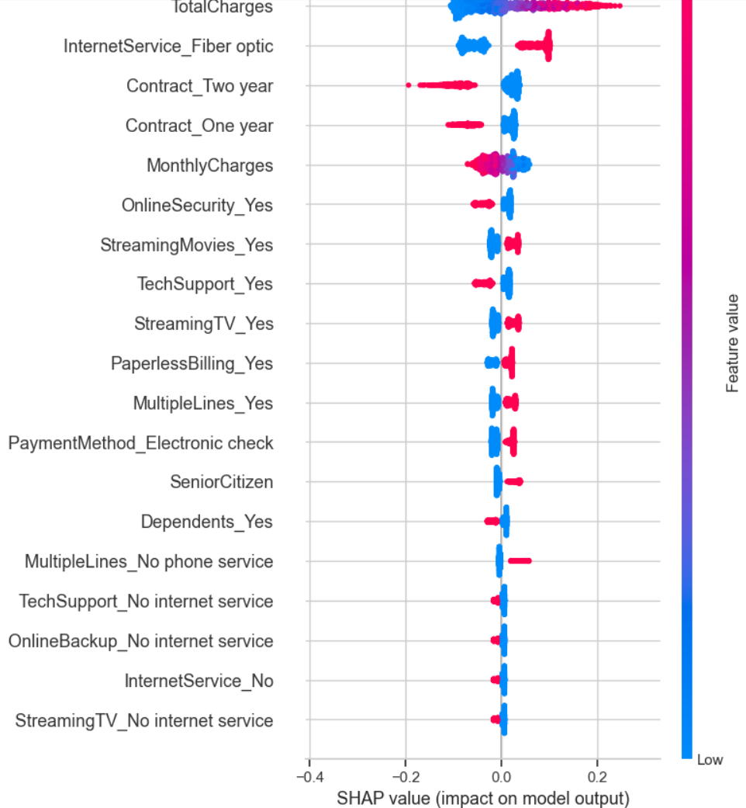

ML Powered Customer Churn Prediction & Business Intelligence Dashboard for a SaaS Company

This project is a complete end-to-end solution for predicting customer churn using machine learning and translating the results into actionable business insights using Power BI.

Problem Statement:
Telecom companies face high customer churn, impacting profitability. This project aims to,
- Predict which customers are likely to churn.
- Understand key features influencing churn.
- Provide business-friendly insights via interactive dashboards.

Tools & Technologies:
* Python (Pandas, NumPy, Matplotlib, Seaborn, Scikit-learn, SHAP)
* Machine Learning: Logistic Regression
* Power BI: Dashboards, Slicers, Q&A, Tooltips
* Jupyter Notebook
* Git & GitHub

ML Pipeline:
- Data Preprocessing & EDA
- Feature Engineering
- Model Training: Logistic Regression
- Model Evaluation: Accuracy, Confusion Matrix, Classification Report
- Explainable AI: SHAP (SHapley Additive exPlanations)

Power BI Dashboard:
Visual breakdown of Churned vs. Retained customers.
Filters for demographics, contracts, and services.
SHAP-based feature impact visuals.
Interactive tooltips for customer-level insights.

Results:
Accuracy: ~78.7%
Key Churn Indicators: Contract Type, Internet Service, Tech Support, Monthly Charges.
Clear business suggestions from dashboard insights.

Snapshots:

SHAP Summary Plot - 

Power BI Donut Chart & Main Dashboard - 

Sample confusion matrix heatmap - 

Key Takeaways: 
Hands-on model explainability using SHAP.
Dashboard storytelling for non-technical stakeholders.
Strong grasp of EDA → Modeling → Visualization workflow.

Future Enhancements:
* Try tree-based models like XGBoost.
* Deploy model with Streamlit.
* Add SQL-based insights.

Author
Darren Stallone Mendez

Aspiring Data Analyst | AI-ML Enthusiast

[LinkedIn](https://www.linkedin.com/in/darrenstallonemendez)  
